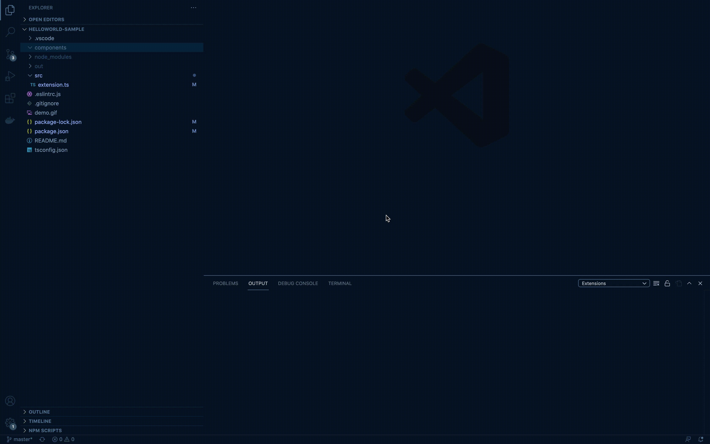
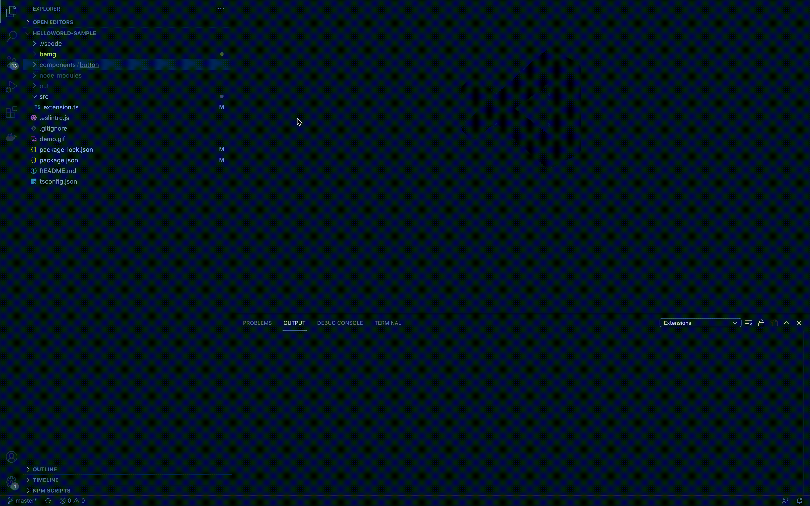

# vs-bem-generate README

Плагин для генерации файлов с кодом по BEM.
Для генерации файлов используется [bemg](https://github.yandex-team.ru/ertema/bemg).
## Features

### Bem init
Команда `Bem init` инициализирует bemg с дефолтными настройками.

### Bem generate
Команда и пункт контекстного меню `Bem generate` в дереве файлов используется для генерации файлов по шаблонам.
Чтобы сгенерировать файлы, нужно указать типы сущностей bem и выбрать нужные типы шаблонов.

### Snippets
Плагин предоставляет возможность использовать сниппеты из конфигурационного файла для более удобной вставки шаблонов с часто используемыми компонентами. Можно использовать как команду `Bem insert snippet` или как обычные vs code.
Подробнее в [Snippets](./docs/snippets.md).

## For more information

* [vs-bem-generate github repository](https://github.yandex-team.ru/pelican/vs-bem-generate)
* [bemg github repository](https://github.yandex-team.ru/ertema/bemg)

## Управление версиями
Для того, чтобы обновить версию плагина, необходимо:
* состоять в организации vs-bem-generate в dev.azure.com. Доступен по ссылке: https://dev.azure.com/{username}/vs-bem-generate.
* сгенерироввать Personal Access Tokens, необходимый для публикации (https://dev.azure.com/vscode -> User settings -> Personal access tokens. Здесь при создании токена нужно в поле Custom defined выбрать Marketplace > Manage, в поле организации - All accessible organizations)
* [опубликовать версию](https://code.visualstudio.com/api/working-with-extensions/publishing-extension)
    - npm install -g vsce
    - vsce login <publisher name>
    - vsce publish

**Enjoy!**