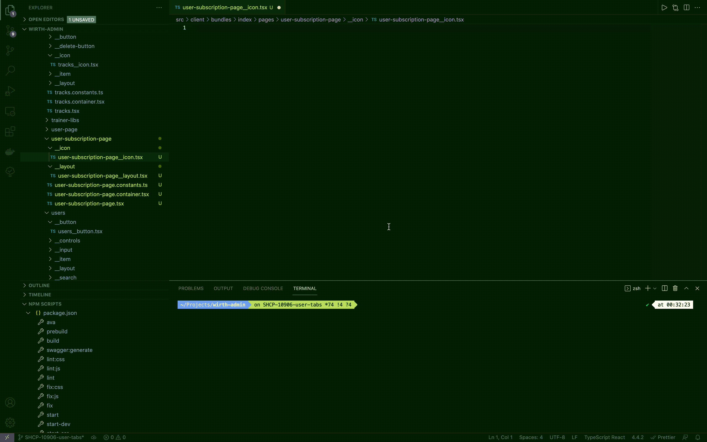

# Snippets
Плагин предоставляет возможность использовать сниппеты из конфигурационного файла для более удобной вставки шаблонов с часто используемыми компонентами. 

>Важно: предполагается, что сниппет вставляется в соответствующий файл по БЭМ. Например, если вы вставляете сниппет `bemg-layout-default`, плагин будет предполагать, что в настоящий момент открыт файл `<block>/__layout/<block>__layout.tsx`. Исходя из этого предположения будут генерироваться названия компонентов и интерфейсов, а также пути импортов констант.



## Настройка

Для настройки сниппетов необходимо добавить в конфигурационный файл ключ "snippets" следующей структуры:

```
{
  "snippets": {
    // languageId - один из языков поддерживаемый vs code (https://code.visualstudio.com/docs/languages/identifiers#_known-language-identifiers)
    [key: languageId]: {
      "snippet-name": {
        "prefix": string[] - лэйблы сниппета, при их вводе будут предлагаться варианты автокомплита
        "body": string[] - тело сниппета, поддерживается полный синтаксис обычных сниппетов vs code (https://code.visualstudio.com/docs/editor/userdefinedsnippets)
        "description": string - описание
      }
    }
}
}
```

## Пример настройки сниппета:
```json
// bemg/config.json

{
  "aliases": {
    ...
  },
  "naming": {
    ...
  },
  "snippets" : {
    "typescriptreact": {
      "lego-button": {
        "prefix": [
          "blb",
          "bemg-lego-button"
        ],
        "body": [
          "import { compose, composeU, ExtractProps } from '@bem-react/core';",
          "import { withSizeS, withViewAction, withViewDefault } from '@yandex-lego/components/Button';",
          "import React, { FC } from 'react';",
          "",
          "import { Button as ButtonBase } from 'client/components/button/button';",
          "",
          "import { cn${TM_FILEPATH/(.*\\/([a-z\\-]+).*)/${2:/pascalcase}/} } from '../${TM_FILEPATH/(.*\\/([a-z\\-]+).*)/$2/}.constants';",
          "",
          "const Button = compose(withSizeS, composeU(withViewAction, withViewDefault))(ButtonBase);",
          "",
          "export type ${TM_FILEPATH/(.*\\/([a-z\\-]+).*)/${2:/pascalcase}/}${TM_FILENAME/(.*__)([a-z\\-]+)(.*)/${2:/pascalcase}/}Props = Omit<ExtractProps<typeof Button>, 'size'>;",
          "",
          "export const ${TM_FILEPATH/(.*\\/([a-z\\-]+).*)/${2:/pascalcase}/}${TM_FILENAME/(.*__)([a-z\\-]+)(.*)/${2:/pascalcase}/}: FC<${TM_FILEPATH/(.*\\/([a-z\\-]+).*)/${2:/pascalcase}/}ButtonProps> = props => (",
          "\t<Button className={cn${TM_FILEPATH/(.*\\/([a-z\\-]+).*)/${2:/pascalcase}/}('button')} size=\"s\" {...props} />",
          ");"
        ],
        "description": "Лего <Button/> с size=\"s\" и view: \"default\" | \"action\""
      },
  }
  }
}
```
